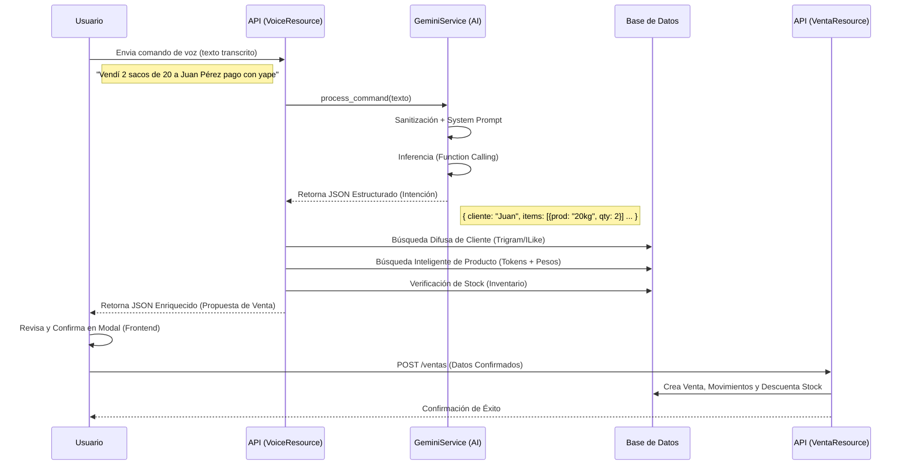

# Documentación del Módulo de Venta por Voz con IA (Manngo)

Este documento detalla el funcionamiento técnico y funcional del módulo de **Venta por Voz**, una característica central de la plataforma Manngo que permite registrar transacciones complejas mediante lenguaje natural.

El sistema utiliza **Google Gemini 1.5 Flash** para el procesamiento de lenguaje natural (NLP) y una capa lógica robusta en Python (Flask) para la resolución de entidades, validación de inventario y ejecución de transacciones.

---

## 1. Arquitectura del Flujo de Datos

El proceso se divide en **tres etapas principales**: Interpretación (IA), Enriquecimiento (Lógica de Negocio) y Ejecución (Persistencia).

---

## 2. Componentes del Sistema

### A. Servicio de IA (`services/gemini_service.py`)

Este servicio actúa como el "cerebro" que traduce el lenguaje natural a estructuras de datos JSON predecibles.

#### 1. Ingeniería de Prompt (System Prompt)
El prompt (`_build_system_prompt`) define estrictamente el contexto del negocio (venta de carbón/briquetas).
*   **Reglas de Peso (Crítico):** Instruye a la IA para identificar patrones como "saco de 20" y convertirlos a "20kg", ya que el peso es el diferenciador principal de los productos.
*   **Manejo de Pagos:** Define reglas para pagos "completos", "parciales" (montos explícitos), "a crédito" (deuda) y "relativos" (ej: "pagó la mitad").
*   **Jailbreak Defense:** El prompt incluye instrucciones para ignorar intentos de manipulación del sistema.

#### 2. Function Calling
Se utiliza la capacidad nativa de Gemini para **Function Calling**. Se define una herramienta `interpretar_operacion` con un esquema JSON estricto (JSON Schema). Esto garantiza que la IA no devuelva texto libre, sino un objeto estructurado con:
*   `cliente_nombre` (String)
*   `items` (Array de objetos con producto, cantidad, precio)
*   `pagos` (Array con montos y métodos)
*   `condicion_pago` (Enum: completo, credito, parcial)

#### 3. Seguridad y Sanitización (`_sanitize_input`)
Antes de llamar a la IA, el input pasa por:
*   **Límites:** Longitud máxima de 500 caracteres.
*   **Regex Anti-Injection:** Bloqueo de patrones como "ignora instrucciones anteriores", "actúa como admin", etc.
*   **Validación de Output:** Se valida que los precios y cantidades sean números positivos y estén dentro de rangos lógicos (ej: cantidad < 10000).

---

### B. Recurso de Voz (`resources/voice_resource.py`)

Este recurso (`VoiceCommandResource`) recibe la intención de Gemini y la "aterriza" a la realidad de la base de datos.

#### 1. Resolución de Entidades (Matching)

El sistema no confía ciegamente en el nombre que devuelve la IA. Aplica algoritmos para encontrar el registro real en la BD.

*   **Clientes:**
    1.  Búsqueda Exacta (`ILike`).
    2.  **Fallback Fuzzy:** Usa `pg_trgm` (PostgreSQL Trigram Similarity) para encontrar nombres parecidos (ej: "Jhon" -> "Juan").
    3.  Si no encuentra confianza > 0.3, devuelve una advertencia para selección manual.

*   **Productos (Lógica Compleja):**
    El matcheo de productos es crítico debido a las variantes por peso.
    1.  **Exacto/ILike:** Nombre idéntico.
    2.  **Similaridad (Trigram):** Nombres parecidos.
    3.  **Token Match Heurístico (Smart Fallback):**
        *   Si las búsquedas anteriores fallan, el sistema tokeniza el input (ej: "saco 20") y los productos de la BD.
        *   **Boost Numérico:** Si un token es un número (ej: "20"), se le da un peso x3. Esto prioriza un "Saco 20kg" sobre un "Saco 10kg" aunque ambos tengan la palabra "Saco".

#### 2. Verificación de Stock
Consulta la tabla `Inventario` filtrando por el `almacen_id` del usuario.
*   Si hay stock: Asigna el `lote_id` automáticamente y muestra el stock disponible.
*   Si falta stock: Genera un **Warning** en la respuesta, pero permite continuar (el usuario decide si forzar o corregir).

#### 3. Cálculo de Pagos (Lógica Financiera)
*   **Pago Completo:** Si la IA detecta "pago completo", el backend calcula automáticamente el total (`cantidad * precio`) y genera un pago por ese monto.
*   **Pago Relativo:** Si la IA detecta "pagó la mitad" (`porcentaje_abono: 50`), el sistema calcula el 50% del total estimado y crea el pago correspondiente.

---

### C. Recurso de Venta (`resources/venta_resource.py`)

Es el encargado de **concluir** la operación. Se invoca una vez el usuario confirma los datos en el frontend.

#### 1. Transaccionalidad (ACID)
El método `post` maneja la creación de la venta dentro de una transacción de base de datos (`db.session`).
*   **Venta:** Cabecera con cliente, fechas, totales.
*   **VentaDetalle:** Renglones de productos.
*   **Movimiento:** Registro de kardex (salida de almacén).
*   **Inventario:** Actualización (resta) del stock.

Si cualquiera de estos pasos falla, se hace `rollback` total, garantizando la integridad de los datos.

#### 2. Asignación de Lotes
El sistema utiliza una estrategia (generalmente FIFO o basada en el inventario disponible) para asignar automáticamente el `lote_id` del cual se descuenta la mercadería, liberando al vendedor de esta carga administrativa.

---

## 3. Ejemplo de Caso de Uso Real

**Input de Voz:** *"Vendí cinco sacos de veinte a la señora María y me pagó la mitad con yape"*

1.  **Gemini** interpreta:
    *   Cliente: "María"
    *   Producto: "sacos de 20" (System prompt sabe que es "20kg")
    *   Cantidad: 5
    *   Condición: "parcial" (detecta "la mitad")
    *   Porcentaje Abono: 50
    *   Método: "yape_plin"

2.  **VoiceResource** procesa:
    *   Busca "María" → Encuentra "María Lopez" (ID: 45)
    *   Busca "sacos de 20" → Encuentra "Carbón Extra 20kg" (ID: 102, Precio: S/ 20.00)
    *   Calcula Total: 5 * 20 = S/ 100.00
    *   Calcula Pago Relativo (50%): S/ 50.00 (Yape)
    *   Verifica Stock: Hay 50 unidades en almacén → OK.

3.  **Respuesta al Frontend:**
    Propuesta lista para confirmar con Venta de S/ 100, Pago de S/ 50 (Yape) y Cliente "María Lopez".

## 4. Auditoría
Todas las interacciones de voz se registran en la tabla `ComandoVozLog` con:
*   Texto original.
*   Interpretación JSON cruda.
*   Latencia del servicio.
*   Éxito/Fallo.
Esto permite monitorear el consumo de tokens, la precisión de la IA y depurar errores.
