# Guía Frontend: Autenticación y Ventas por Voz

Esta guía explica cómo implementar en el frontend el flujo completo de autenticación y creación de ventas mediante comandos de voz en la API de Manngo.

## Tabla de Contenidos

1. [Flujo General](#flujo-general)
2. [Paso 1: Autenticación](#paso-1-autenticación)
3. [Paso 2: Capturar Audio y Transcribir](#paso-2-capturar-audio-y-transcribir)
4. [Paso 3: Enviar Comando de Voz](#paso-3-enviar-comando-de-voz)
5. [Paso 4: Presentar Datos para Confirmación](#paso-4-presentar-datos-para-confirmación)
6. [Paso 5: Crear la Venta](#paso-5-crear-la-venta)
7. [Ejemplos de Implementación](#ejemplos-de-implementación)

---

## Flujo General

```mermaid
sequenceDiagram
    participant U as Usuario Frontend
    participant F as Frontend App
    participant API as Backend API
    participant G as Gemini Service
    
    U->>F: 1. Login (username, password)
    F->>API: POST /auth
    API-->>F: access_token + user data
    F->>F: Guardar token en localStorage
    
    U->>F: 2. Graba comando de voz
    F->>F: Procesar audio (Web Speech API)
    F->>F: Obtener texto transcrito
    
    U->>F: 3. Envía comando de texto
    F->>API: POST /voice/command (con token)
    API->>G: Interpreta comando
    G-->>API: Datos estructurados
    API-->>F: Datos enriquecidos + warnings
    
    F->>U: 4. Muestra modal de confirmación
    U->>F: Confirma o edita datos
    
    F->>API: 5. POST /ventas (con token)
    API-->>F: Venta creada con ID
    F->>U: Muestra confirmación
```



---

## Paso 1: Autenticación

### Endpoint: `POST /auth`

**Descripción:** Autenticar usuario y obtener token JWT.

### Request

**Headers:**
```http
Content-Type: application/json
```

**Body:**
```json
{
  "username": "vendedor_lima1",
  "password": "admin123"
}
```

### Response Exitosa (200 OK)

```json
{
  "access_token": "eyJhbGciOiJIUzI1NiIsInR5cCI6IkpXVCJ9...",
  "token_type": "Bearer",
  "expires_in": 28800,
  "user": {
    "id": 4,
    "username": "vendedor_lima1",
    "rol": "usuario",
    "almacen_id": 1,
    "almacen_nombre": "Almacén Central Lima"
  }
}
```

### Response de Error (401 Unauthorized)

```json
{
  "message": "Credenciales inválidas"
}
```

### Implementación Frontend (JavaScript)

```javascript
// Función de login
async function login(username, password) {
  try {
    const response = await fetch('https://localhost:4200/auth', {
      method: 'POST',
      headers: {
        'Content-Type': 'application/json'
      },
      body: JSON.stringify({ username, password })
    });
    
    if (!response.ok) {
      const error = await response.json();
      throw new Error(error.message || 'Error al iniciar sesión');
    }
    
    const data = await response.json();
    
    // Guardar token y datos del usuario
    localStorage.setItem('access_token', data.access_token);
    localStorage.setItem('user', JSON.stringify(data.user));
    localStorage.setItem('token_expires_at', Date.now() + (data.expires_in * 1000));
    
    return data;
  } catch (error) {
    console.error('Error en login:', error);
    throw error;
  }
}

// Verificar si el token sigue válido
function isTokenValid() {
  const expiresAt = localStorage.getItem('token_expires_at');
  if (!expiresAt) return false;
  return Date.now() < parseInt(expiresAt);
}

// Obtener token para las peticiones
function getAuthToken() {
  if (!isTokenValid()) {
    // Redirigir al login o renovar token
    window.location.href = '/login';
    return null;
  }
  return localStorage.getItem('access_token');
}
```

---

## Paso 2: Capturar Audio y Transcribir

El frontend debe capturar el audio del usuario y convertirlo a texto. Puedes usar **Web Speech API** (nativa del navegador) o servicios externos como **Google Speech-to-Text**.

### Opción A: Web Speech API (Recomendado - Gratis)

```javascript
// Inicializar reconocimiento de voz
let recognition = null;

function initVoiceRecognition() {
  // Verificar soporte del navegador
  const SpeechRecognition = window.SpeechRecognition || window.webkitSpeechRecognition;
  
  if (!SpeechRecognition) {
    alert('Tu navegador no soporta reconocimiento de voz');
    return null;
  }
  
  recognition = new SpeechRecognition();
  recognition.lang = 'es-PE'; // Español de Perú
  recognition.continuous = false; // Una sola frase
  recognition.interimResults = false; // Solo resultados finales
  
  return recognition;
}

// Función para grabar comando de voz
function recordVoiceCommand() {
  return new Promise((resolve, reject) => {
    if (!recognition) {
      recognition = initVoiceRecognition();
    }
    
    if (!recognition) {
      reject(new Error('Reconocimiento de voz no disponible'));
      return;
    }
    
    // Callbacks
    recognition.onresult = (event) => {
      const transcript = event.results[0][0].transcript;
      resolve(transcript);
    };
    
    recognition.onerror = (event) => {
      reject(new Error(`Error de reconocimiento: ${event.error}`));
    };
    
    recognition.onend = () => {
      console.log('Reconocimiento de voz finalizado');
    };
    
    // Iniciar grabación
    recognition.start();
  });
}

// Ejemplo de uso
async function handleVoiceButton() {
  try {
    // Mostrar indicador visual de "grabando..."
    showRecordingIndicator();
    
    const transcript = await recordVoiceCommand();
    console.log('Texto reconocido:', transcript);
    
    // Enviar a la API
    await sendVoiceCommand(transcript);
    
  } catch (error) {
    console.error('Error al grabar:', error);
    alert('Error al procesar voz: ' + error.message);
  } finally {
    hideRecordingIndicator();
  }
}
```

### Opción B: Usar un Input de Texto Manual

Para testing o cuando el reconocimiento de voz falla:

```html
<div class="voice-input-container">
  <button id="voiceBtn" onclick="handleVoiceButton()">
    🎤 Grabar Comando
  </button>
  <input 
    type="text" 
    id="manualInput" 
    placeholder="O escribe el comando manualmente..."
    onkeypress="if(event.key === 'Enter') sendManualCommand()"
  />
</div>
```

---

## Paso 3: Enviar Comando de Voz

### Endpoint: `POST /voice/command`

**Descripción:** Procesa el comando de voz, interpreta la intención con Gemini, resuelve entidades (clientes, productos) y verifica stock.

### Request

**Headers:**
```http
Authorization: Bearer {access_token}
Content-Type: application/json
```

**Body:**
```json
{
  "text": "vendí dos sacos de 50 kilos a restaurant el buen sabor pago completo"
}
```

### Response Exitosa (200 OK)

El endpoint devuelve datos **enriquecidos** listos para mostrar al usuario:

```json
{
  "status": "success",
  "processed_action": "confirmar_operacion",
  "data": {
    "cliente": {
      "id": 1,
      "nombre": "Restaurant El Buen Sabor",
      "match_type": "exact"
    },
    "items": [
      {
        "producto_nombre_buscado": "sacos de 50 kilos",
        "cantidad": 2,
        "precio_unitario": 180.0,
        "producto_id": 1,
        "producto_nombre": "Saco 50kg Premium",
        "stock_actual": 80.0,
        "lote_id": 1,
        "subtotal": 360.0
      }
    ],
    "pagos": [
      {
        "monto": 360.0,
        "metodo_pago": "efectivo",
        "es_deposito": false
      }
    ],
    "warnings": [
      "Se generó un pago automático por el total: S/ 360.0"
    ],
    "contexto": {
      "almacen_id": 1,
      "almacen_nombre": "Almacén Central Lima"
    }
  },
  "original_text": "vendí dos sacos de 50 kilos a restaurant el buen sabor pago completo",
  "performance": {
    "latency_ms": 245
  }
}
```

### Casos Especiales en la Response

#### Cliente no encontrado:
```json
{
  "cliente": {
    "nombre_buscado": "restaurante del centro"
  },
  "warnings": [
    "Cliente 'restaurante del centro' no encontrado. Se requiere seleccionar uno manualmente."
  ]
}
```

#### Producto con búsqueda difusa:
```json
{
  "items": [{
    "producto_nombre": "Saco 50kg Premium",
    "producto_nombre_buscado": "saco de cincuenta"
  }],
  "warnings": [
    "No se encontró 'saco de cincuenta', se asumió 'Saco 50kg Premium' (similarity)."
  ]
}
```

#### Stock insuficiente:
```json
{
  "items": [{
    "cantidad": 100,
    "stock_actual": 80.0
  }],
  "warnings": [
    "Stock insuficiente para 'Saco 50kg Premium'. Solicitado: 100, Disponible: 80"
  ]
}
```

### Implementación Frontend

```javascript
async function sendVoiceCommand(commandText) {
  try {
    const token = getAuthToken();
    if (!token) {
      throw new Error('No estás autenticado');
    }
    
    const response = await fetch('https://api.manngo.com/voice/command', {
      method: 'POST',
      headers: {
        'Authorization': `Bearer ${token}`,
        'Content-Type': 'application/json'
      },
      body: JSON.stringify({ text: commandText })
    });
    
    if (!response.ok) {
      const error = await response.json();
      throw new Error(error.message || 'Error al procesar comando');
    }
    
    const result = await response.json();
    
    // Verificar si es una operación que requiere confirmación
    if (result.processed_action === 'confirmar_operacion') {
      // Mostrar modal de confirmación
      showConfirmationModal(result.data, result.original_text);
    } else {
      // Otro tipo de acción (error, etc.)
      alert(result.gemini_message || 'Comando procesado');
    }
    
  } catch (error) {
    console.error('Error al enviar comando:', error);
    alert('Error: ' + error.message);
  }
}
```

---

## Paso 4: Presentar Datos para Confirmación

El frontend debe mostrar un **modal de confirmación** que permita al usuario:
- Ver los datos interpretados
- Corregir errores (cliente incorrecto, cantidades, etc.)
- Ver warnings (stock insuficiente, etc.)
- Confirmar o cancelar

### Ejemplo de Modal (HTML + JavaScript)

```html
<div id="confirmModal" class="modal" style="display:none;">
  <div class="modal-content">
    <h2>Confirmar Venta</h2>
    
    <!-- Comando original -->
    <div class="original-command">
      <strong>Comando:</strong> <span id="originalText"></span>
    </div>
    
    <!-- Warnings -->
    <div id="warningsContainer" class="warnings"></div>
    
    <!-- Cliente -->
    <div class="form-group">
      <label>Cliente:</label>
      <select id="clienteSelect">
        <!-- Opciones cargadas dinámicamente -->
      </select>
    </div>
    
    <!-- Items -->
    <div id="itemsContainer">
      <!-- Items generados dinámicamente -->
    </div>
    
    <!-- Total -->
    <div class="total">
      <strong>Total:</strong> S/ <span id="totalAmount">0.00</span>
    </div>
    
    <!-- Pagos -->
    <div id="pagosContainer">
      <!-- Pagos generados dinámicamente -->
    </div>
    
    <!-- Botones -->
    <div class="modal-actions">
      <button onclick="closeModal()">Cancelar</button>
      <button onclick="confirmAndCreateSale()" class="btn-primary">
        Confirmar Venta
      </button>
    </div>
  </div>
</div>
```

```javascript
let currentVoiceData = null;

function showConfirmationModal(data, originalText) {
  currentVoiceData = data;
  
  // Mostrar modal
  document.getElementById('confirmModal').style.display = 'block';
  
  // Llenar datos
  document.getElementById('originalText').textContent = originalText;
  
  // Mostrar warnings
  const warningsContainer = document.getElementById('warningsContainer');
  if (data.warnings && data.warnings.length > 0) {
    warningsContainer.innerHTML = data.warnings.map(w => 
      `<div class="warning">⚠️ ${w}</div>`
    ).join('');
  } else {
    warningsContainer.innerHTML = '';
  }
  
  // Cargar clientes en el select
  loadClientes(data.cliente?.id);
  
  // Renderizar items
  renderItems(data.items);
  
  // Renderizar pagos
  renderPagos(data.pagos);
  
  // Calcular total
  updateTotal();
}

function renderItems(items) {
  const container = document.getElementById('itemsContainer');
  container.innerHTML = items.map((item, index) => `
    <div class="item-row" data-index="${index}">
      <div class="form-group">
        <label>Producto:</label>
        <input type="text" value="${item.producto_nombre || item.producto_nombre_buscado}" readonly />
      </div>
      <div class="form-group">
        <label>Cantidad:</label>
        <input 
          type="number" 
          value="${item.cantidad}" 
          onchange="updateItemQuantity(${index}, this.value)"
        />
        <small>Stock: ${item.stock_actual}</small>
      </div>
      <div class="form-group">
        <label>Precio Unit.:</label>
        <input 
          type="number" 
          step="0.01"
          value="${item.precio_unitario}" 
          onchange="updateItemPrice(${index}, this.value)"
        />
      </div>
      <div class="form-group">
        <label>Subtotal:</label>
        <span class="subtotal">S/ ${item.subtotal.toFixed(2)}</span>
      </div>
    </div>
  `).join('');
}

function renderPagos(pagos) {
  const container = document.getElementById('pagosContainer');
  if (!pagos || pagos.length === 0) {
    container.innerHTML = '<p>Venta al crédito (sin pagos iniciales)</p>';
    return;
  }
  
  container.innerHTML = pagos.map((pago, index) => `
    <div class="pago-row">
      <strong>Pago ${index + 1}:</strong> 
      S/ ${pago.monto.toFixed(2)} 
      (${pago.metodo_pago})
    </div>
  `).join('');
}

function updateTotal() {
  if (!currentVoiceData) return;
  
  const total = currentVoiceData.items.reduce((sum, item) => 
    sum + item.subtotal, 0
  );
  
  document.getElementById('totalAmount').textContent = total.toFixed(2);
}

function closeModal() {
  document.getElementById('confirmModal').style.display = 'none';
  currentVoiceData = null;
}
```

---

## Paso 5: Crear la Venta

Una vez confirmados los datos, se envía la venta al backend.

### Endpoint: `POST /ventas`

### Request

**Headers:**
```http
Authorization: Bearer {access_token}
Content-Type: application/json
```

**Body:**
```json
{
  "cliente_id": 1,
  "almacen_id": 1,
  "tipo_pago": "contado",
  "fecha": "2024-02-01T10:30:00-05:00",
  "detalles": [
    {
      "presentacion_id": 1,
      "cantidad": 2,
      "precio_unitario": 180.00
    }
  ]
}
```

### Response Exitosa (201 Created)

```json
{
  "id": 10,
  "cliente_id": 1,
  "almacen_id": 1,
  "vendedor_id": 4,
  "fecha": "2024-02-01T10:30:00-05:00",
  "total": 360.00,
  "tipo_pago": "contado",
  "estado_pago": "pendiente",
  "created_at": "2024-02-01T10:30:15-05:00",
  "detalles": [
    {
      "id": 25,
      "presentacion_id": 1,
      "cantidad": 2,
      "precio_unitario": 180.00,
      "lote_id": 1
    }
  ]
}
```

### Implementación Frontend

```javascript
async function confirmAndCreateSale() {
  try {
    if (!currentVoiceData) {
      throw new Error('No hay datos para crear la venta');
    }
    
    const token = getAuthToken();
    const user = JSON.parse(localStorage.getItem('user'));
    
    // Preparar el body de la venta
    const ventaData = {
      cliente_id: parseInt(document.getElementById('clienteSelect').value),
      almacen_id: user.almacen_id,
      tipo_pago: currentVoiceData.pagos.length > 0 ? 'contado' : 'credito',
      fecha: new Date().toISOString(),
      detalles: currentVoiceData.items
        .filter(item => item.producto_id) // Solo items válidos
        .map(item => ({
          presentacion_id: item.producto_id,
          cantidad: item.cantidad,
          precio_unitario: item.precio_unitario
        }))
    };
    
    // Crear la venta
    const response = await fetch('https://api.manngo.com/ventas', {
      method: 'POST',
      headers: {
        'Authorization': `Bearer ${token}`,
        'Content-Type': 'application/json'
      },
      body: JSON.stringify(ventaData)
    });
    
    if (!response.ok) {
      const error = await response.json();
      throw new Error(error.error || 'Error al crear la venta');
    }
    
    const venta = await response.json();
    console.log('Venta creada:', venta);
    
    // Si hay pagos, crearlos
    if (currentVoiceData.pagos && currentVoiceData.pagos.length > 0) {
      await createPayments(venta.id, currentVoiceData.pagos);
    }
    
    // Cerrar modal y mostrar éxito
    closeModal();
    alert(`✅ Venta #${venta.id} creada exitosamente por S/ ${venta.total}`);
    
    // Opcional: Recargar lista de ventas
    // loadVentasList();
    
  } catch (error) {
    console.error('Error al crear venta:', error);
    alert('Error al crear venta: ' + error.message);
  }
}

// Crear pagos asociados a la venta
async function createPayments(ventaId, pagos) {
  const token = getAuthToken();
  
  for (const pago of pagos) {
    try {
      await fetch('https://api.manngo.com/pagos', {
        method: 'POST',
        headers: {
          'Authorization': `Bearer ${token}`,
          'Content-Type': 'application/json'
        },
        body: JSON.stringify({
          venta_id: ventaId,
          monto: pago.monto,
          metodo_pago: pago.metodo_pago,
          fecha: new Date().toISOString()
        })
      });
    } catch (error) {
      console.error('Error al crear pago:', error);
    }
  }
}
```

---

## Ejemplos de Implementación

### Ejemplo Completo: Componente React

```jsx
import React, { useState, useEffect } from 'react';

function VentasPorVoz() {
  const [isRecording, setIsRecording] = useState(false);
  const [showModal, setShowModal] = useState(false);
  const [voiceData, setVoiceData] = useState(null);
  const [clientes, setClientes] = useState([]);
  
  // Cargar clientes al montar
  useEffect(() => {
    loadClientes();
  }, []);
  
  const loadClientes = async () => {
    try {
      const token = localStorage.getItem('access_token');
      const response = await fetch('https://api.manngo.com/clientes', {
        headers: { 'Authorization': `Bearer ${token}` }
      });
      const data = await response.json();
      setClientes(data.data || []);
    } catch (error) {
      console.error('Error al cargar clientes:', error);
    }
  };
  
  const handleVoiceRecord = async () => {
    try {
      setIsRecording(true);
      
      // Web Speech API
      const SpeechRecognition = window.SpeechRecognition || window.webkitSpeechRecognition;
      const recognition = new SpeechRecognition();
      recognition.lang = 'es-PE';
      
      recognition.onresult = async (event) => {
        const transcript = event.results[0][0].transcript;
        console.log('Transcripción:', transcript);
        await processVoiceCommand(transcript);
      };
      
      recognition.onerror = (error) => {
        console.error('Error de reconocimiento:', error);
        alert('Error al grabar: ' + error.error);
      };
      
      recognition.onend = () => {
        setIsRecording(false);
      };
      
      recognition.start();
      
    } catch (error) {
      console.error('Error:', error);
      setIsRecording(false);
    }
  };
  
  const processVoiceCommand = async (text) => {
    try {
      const token = localStorage.getItem('access_token');
      const response = await fetch('https://api.manngo.com/voice/command', {
        method: 'POST',
        headers: {
          'Authorization': `Bearer ${token}`,
          'Content-Type': 'application/json'
        },
        body: JSON.stringify({ text })
      });
      
      if (!response.ok) throw new Error('Error al procesar comando');
      
      const result = await response.json();
      
      if (result.processed_action === 'confirmar_operacion') {
        setVoiceData(result.data);
        setShowModal(true);
      }
    } catch (error) {
      console.error('Error:', error);
      alert('Error: ' + error.message);
    }
  };
  
  const confirmSale = async () => {
    try {
      const token = localStorage.getItem('access_token');
      const user = JSON.parse(localStorage.getItem('user'));
      
      const ventaData = {
        cliente_id: voiceData.cliente.id,
        almacen_id: user.almacen_id,
        tipo_pago: voiceData.pagos.length > 0 ? 'contado' : 'credito',
        fecha: new Date().toISOString(),
        detalles: voiceData.items.map(item => ({
          presentacion_id: item.producto_id,
          cantidad: item.cantidad,
          precio_unitario: item.precio_unitario
        }))
      };
      
      const response = await fetch('https://api.manngo.com/ventas', {
        method: 'POST',
        headers: {
          'Authorization': `Bearer ${token}`,
          'Content-Type': 'application/json'
        },
        body: JSON.stringify(ventaData)
      });
      
      if (!response.ok) throw new Error('Error al crear venta');
      
      const venta = await response.json();
      alert(`✅ Venta #${venta.id} creada exitosamente`);
      
      setShowModal(false);
      setVoiceData(null);
    } catch (error) {
      alert('Error: ' + error.message);
    }
  };
  
  return (
    <div className="ventas-por-voz">
      <h1>Ventas por Voz</h1>
      
      <button 
        onClick={handleVoiceRecord}
        disabled={isRecording}
        className={isRecording ? 'recording' : ''}
      >
        {isRecording ? '🔴 Grabando...' : '🎤 Grabar Comando'}
      </button>
      
      {showModal && voiceData && (
        <div className="modal">
          <h2>Confirmar Venta</h2>
          
          {voiceData.warnings.map((w, i) => (
            <div key={i} className="warning">⚠️ {w}</div>
          ))}
          
          <div>
            <strong>Cliente:</strong> {voiceData.cliente?.nombre || 'No identificado'}
          </div>
          
          <h3>Items:</h3>
          {voiceData.items.map((item, i) => (
            <div key={i} className="item">
              {item.cantidad}x {item.producto_nombre} - S/ {item.subtotal}
            </div>
          ))}
          
          <div className="total">
            <strong>Total:</strong> S/ {
              voiceData.items.reduce((sum, item) => sum + item.subtotal, 0).toFixed(2)
            }
          </div>
          
          <div className="actions">
            <button onClick={() => setShowModal(false)}>Cancelar</button>
            <button onClick={confirmSale} className="primary">Confirmar</button>
          </div>
        </div>
      )}
    </div>
  );
}

export default VentasPorVoz;
```

---

## Comandos de Voz Soportados

### Ejemplos de Comandos Válidos

| Comando | Resultado |
|---------|-----------|
| `"vendí dos sacos de 50 a Juan Pérez pago completo"` | 2x Saco 50kg, pagado completo |
| `"tres bolsas de 10 para María al crédito"` | 3x Bolsa 10kg, sin pago |
| `"Carlos compró 5 sacos de 30 a 150 soles pagó 500 con yape"` | 5x Saco 30kg a S/150 c/u, pago parcial S/500 por Yape |
| `"un saco grande a Rosa pago completo y costó 20 el delivery"` | 1x Saco 30kg, pagado + gasto de S/20 en logística |
| `"vendí dos sacos de 20 pagó la mitad en efectivo"` | 2x Saco 20kg, pago del 50% en efectivo |

### Palabras Clave que Entiende Gemini

- **Pago completo:** "pago completo", "ya pagó todo", "canceló", "al contado"
- **Al crédito:** "al crédito", "fiado", "luego paga", "debe"
- **Pago parcial:** "pagó 500", "dejó 300", "dio 100"
- **Pago relativo:** "pagó la mitad", "dejó el 50%", "un tercio"
- **Métodos de pago:** "con yape", "en efectivo", "transferencia", "con tarjeta"
- **Gastos:** "costó 30 el envío", "le pagué 50 al ayudante"

---

## Manejo de Errores Comunes

### Error: Token Expirado (401)

```javascript
// Interceptar errores 401 y redirigir al login
async function apiRequest(url, options) {
  const response = await fetch(url, options);
  
  if (response.status === 401) {
    // Token expirado, limpiar y redirigir
    localStorage.clear();
    window.location.href = '/login';
    throw new Error('Sesión expirada');
  }
  
  return response;
}
```

### Error: Cliente no encontrado

Si `cliente.id` es `null` en la respuesta de `/voice/command`, mostrar un selector de clientes:

```javascript
if (!voiceData.cliente?.id) {
  // Mostrar selector de clientes
  showClienteSelector(clientes);
}
```

### Error: Stock insuficiente

Mostrar advertencia prominente y no permitir confirmar:

```javascript
const hasStockIssues = voiceData.warnings.some(w => w.includes('Stock insuficiente'));

if (hasStockIssues) {
  document.getElementById('confirmBtn').disabled = true;
  document.getElementById('confirmBtn').textContent = 'Stock Insuficiente';
}
```

---

## Consideraciones de Seguridad

1. **Nunca almacenar el password:** Solo guardar el token JWT
2. **Renovar token antes de expirar:** Implementar refresh si es posible
3. **HTTPS obligatorio:** Todas las peticiones deben ser HTTPS en producción
4. **Validar en frontend:** Aunque el backend valida, mostrar errores de forma amigable
5. **Limpiar datos sensibles:** Al hacer logout, limpiar `localStorage` completamente

```javascript
function logout() {
  localStorage.clear();
  window.location.href = '/login';
}
```

---

## Resumen del Flujo

1. ✅ **Login:** Obtener `access_token` y guardar en `localStorage`
2. ✅ **Grabar voz:** Usar Web Speech API o input manual
3. ✅ **Enviar a `/voice/command`:** Backend interpreta con Gemini
4. ✅ **Mostrar modal:** Usuario confirma o edita datos
5. ✅ **Crear venta:** POST a `/ventas` con los datos confirmados
6. ✅ **Crear pagos (opcional):** Si hubo pagos, POST a `/pagos`

---

## Recursos Adicionales

- **Web Speech API Docs:** https://developer.mozilla.org/en-US/docs/Web/API/Web_Speech_API
- **JWT Best Practices:** https://jwt.io/introduction
- **Manngo API Docs:** (consultar `API_OVERVIEW.md` en el proyecto)

---

**¡Listo!** Con esta guía el equipo de frontend puede implementar completamente el flujo de autenticación y ventas por voz. 🎉
